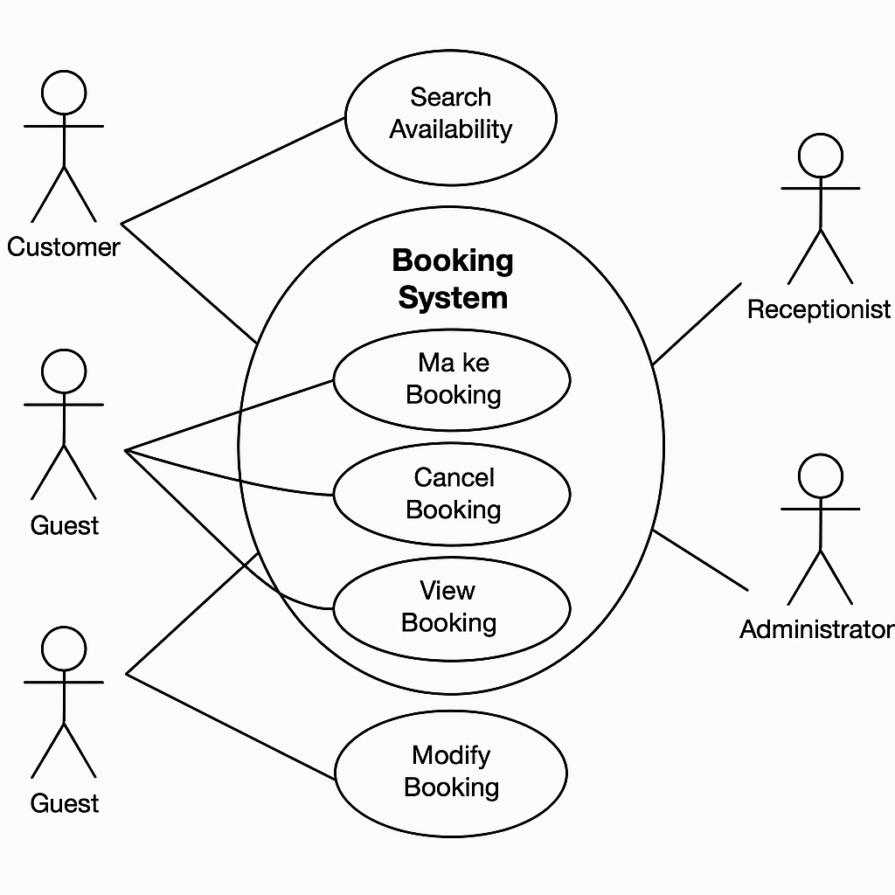

# Requirement Analysis in Software Development

This repository contains the requirement analysis for a Booking Management System. It outlines the structured approach to understanding, documenting, and validating system requirements before software development begins. This project simulates real-world requirement engineering practices to ensure clear communication and planning in the SDLC(Software Develoopment Life Cycle).

## What is Requirement Analysis?

Requirement Analysis is all about understanding what a software system needs to do — before any code is written. It's the phase where we carefully gather, examine, and organize the expectations of users, clients, and stakeholders. In short, it's how we make sure everyone is on the same page.

In the context of the Software Development Life Cycle (SDLC), this stage is crucial. Without it, projects can easily go off track, resulting in wasted time, effort, and misaligned outcomes. By defining clear requirements early on, the development process becomes smoother, more efficient, and better aligned with the actual needs of the people using the system.

### Why It Matters in SDLC

- **Clarity from the start** – Everyone involved understands what the system is supposed to do.
- **Fewer surprises later** – Catching gaps or contradictions early prevents costly changes during development.
- **Better collaboration** – Developers, testers, and stakeholders work with a shared vision.

## Why is Requirement Analysis Important?

Requirement Analysis isn’t just the first step in building software — it’s the foundation that shapes the entire project. Without it, teams risk building the wrong thing, wasting valuable time and resources. Here’s why it’s such a crucial part of the SDLC:

1. **Prevents Miscommunication and Scope Creep**  
   By clearly defining what the system should do and what it shouldn’t, Requirement Analysis helps everyone — developers, clients, and stakeholders — stay aligned. It avoids misunderstandings and keeps the project from expanding beyond what was originally planned.

2. **Improves Planning and Estimation**  
   When requirements are well-analyzed and documented, it becomes much easier to estimate time, cost, and resources. This leads to more realistic project schedules and better risk management.

3. **Increases the Chances of Project Success**  
   Projects that begin with strong requirement analysis are more likely to meet user needs and business goals. It ensures the final product is useful, usable, and worth the investment.

## Key Activities in Requirement Analysis

Requirement Analysis is not a one-time task — it's a process made up of several essential activities that help define and refine what a system should do. Each activity builds on the previous one to ensure the requirements are complete, clear, and correct.

- **Requirement Gathering**  
  This is the initial step where information is collected from stakeholders, users, and other sources to understand what the system is supposed to achieve. It includes studying existing systems, reviewing documents, and noting expectations.

- **Requirement Elicitation**  
  Elicitation goes beyond just gathering — it's about actively engaging with stakeholders through interviews, surveys, workshops, and brainstorming sessions to uncover detailed and sometimes hidden requirements.

- **Requirement Documentation**  
  After collecting and eliciting requirements, they need to be clearly documented. This can include creating Software Requirement Specifications (SRS), user stories, use cases, and diagrams that capture what the system should do.

- **Requirement Analysis and Modeling**  
  At this stage, the documented requirements are carefully analyzed to check for consistency, completeness, feasibility, and clarity. Modeling tools and techniques (like use case diagrams or data flow diagrams) help visualize and validate the system’s behavior.

- **Requirement Validation**  
  Finally, validation ensures the documented requirements actually reflect the needs of stakeholders and users. This can involve reviews, walkthroughs, and approval meetings. The goal is to confirm that everyone agrees on what’s being built — before development starts.

## Types of Requirements

Understanding the types of requirements is essential to building a reliable and user-friendly system. In this section, we differentiate between **Functional Requirements** and **Non-functional Requirements** using the hotel booking system case study.

### Functional Requirements

Functional requirements define what the system should do — the specific features and interactions it must support. These are directly tied to the functionality expected by users.

**Examples in the Hotel Booking System:**
- Users should be able to search for hotels based on location, date, and guest count.
- Hotel managers should be able to log in and update hotel details (e.g., availability, pricing).
- Customers should be able to make a booking and receive a confirmation.
- The system must integrate with a third-party payment service to process payments securely.
- Notifications should be sent to hotel managers when a new booking is made.

### Non-functional Requirements

Non-functional requirements specify *how* the system performs its tasks rather than what it does. They are crucial for user satisfaction, scalability, and performance.

**Examples in the Hotel Booking System:**
- The system should handle high traffic efficiently using a microservice architecture.
- Search results should be returned in less than 2 seconds, leveraging Elasticsearch for optimized querying.
- Redis should be used for caching to reduce database load and improve response time.
- System should ensure data consistency between master and slave databases.
- The application should be highly available and fault-tolerant, using services like load balancers, CDN, and message queues.

## Use Case Diagrams

Use Case Diagrams are visual representations of the interactions between users (actors) and a system. They help in identifying system functionality, understanding user requirements, and simplifying communication between stakeholders and developers.

### Benefits of Use Case Diagrams:
- Clearly define system boundaries and user roles.
- Provide a high-level view of system functionality.
- Simplify complex requirements into manageable components.
- Aid communication with non-technical stakeholders.

### Use Case Diagram

The diagram below represents a basic use case model for the hotel booking platform, involving both **Customers** and **Hotel Managers** as primary actors.

## Acceptance Criteria

**Acceptance Criteria** are a set of conditions that a software product must satisfy to be accepted by a user, customer, or other stakeholders. They are used to confirm when a user story or feature is complete and working as intended.

### Importance of Acceptance Criteria in Requirement Analysis

- **Clarity**: They define exactly what needs to be done for a feature to be considered complete, reducing ambiguity.
- **Alignment**: Ensure that developers, testers, and stakeholders are all on the same page.
- **Testability**: Serve as the basis for writing test cases, ensuring that the implementation can be verified.
- **Scope Control**: Help prevent scope creep by clearly outlining what is and isn’t included in a feature.

### Example: Acceptance Criteria for the Checkout Feature

Feature: **Hotel Booking Checkout**

**Given** a user has selected a hotel and filled in the booking details,  
**When** they proceed to checkout,  
**Then** the system should:

1. Validate that all required fields (guest info, dates, payment method) are filled.
2. Display a booking summary with price breakdown and cancellation policy.
3. Allow the user to confirm the booking and proceed to payment.
4. Process the payment using an integrated third-party payment service.
5. On successful payment, generate a booking ID and display confirmation.
6. Send a confirmation email and/or in-app notification to the customer.
7. Update the hotel’s availability in real-time.

